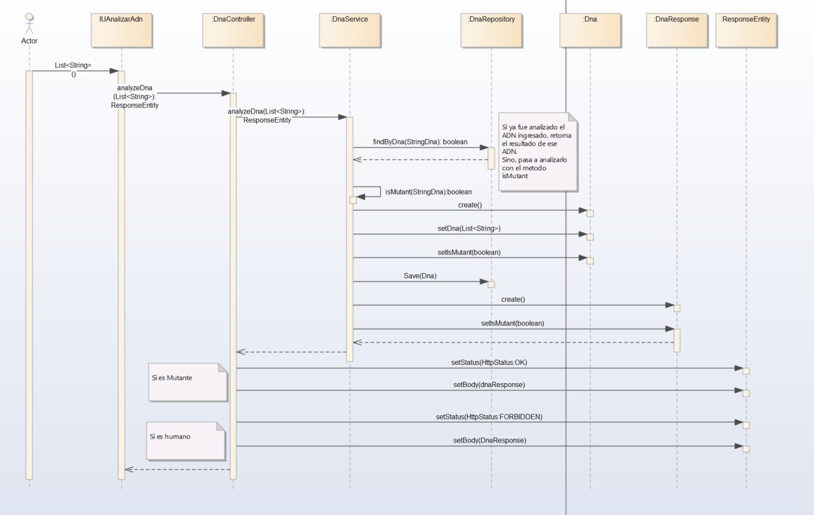
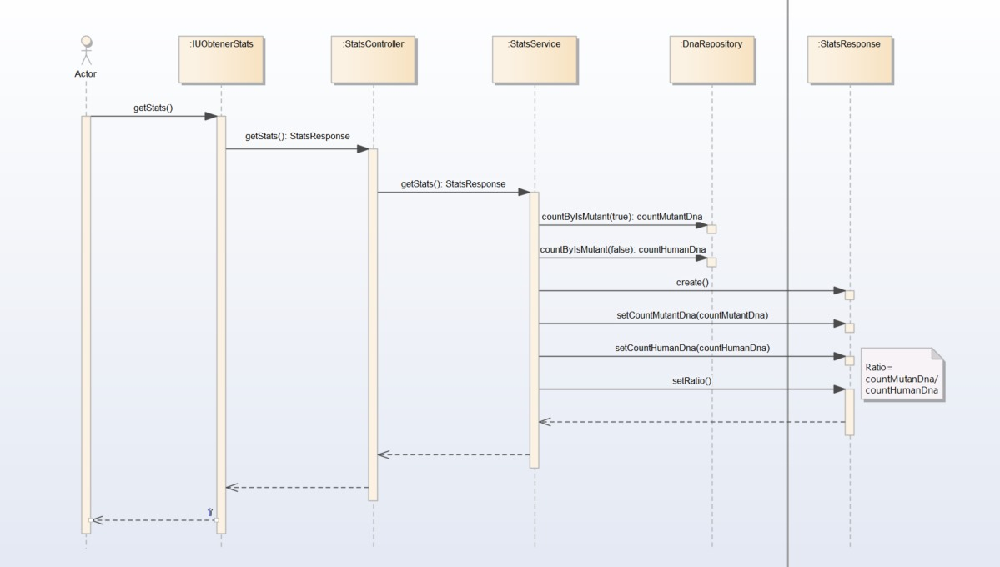
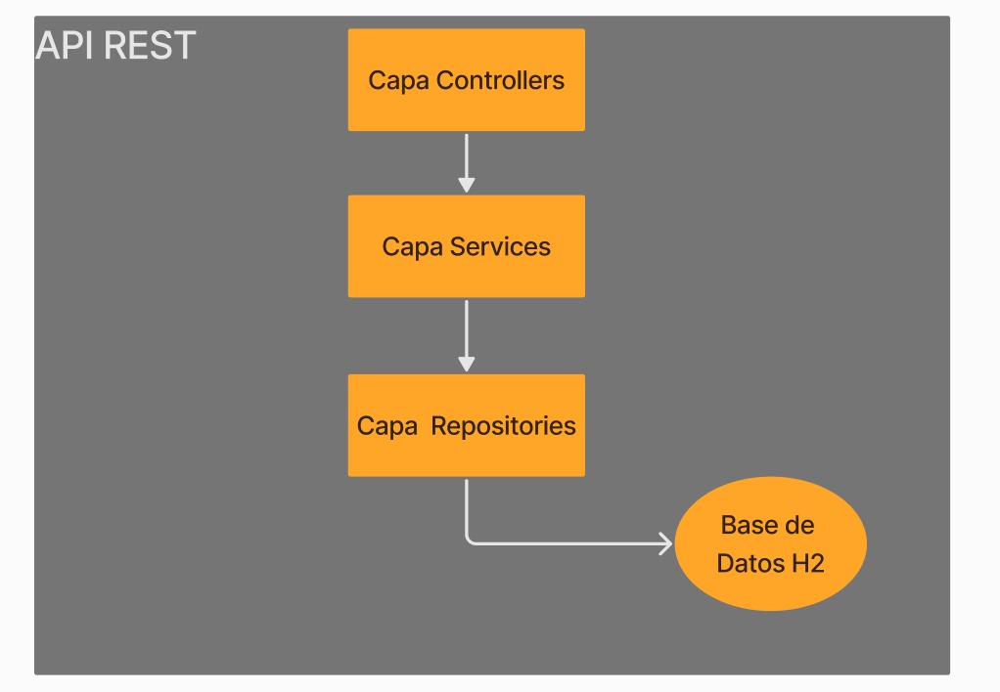
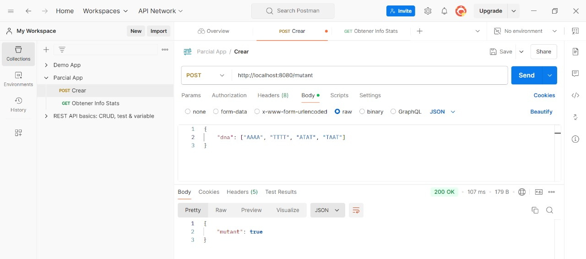
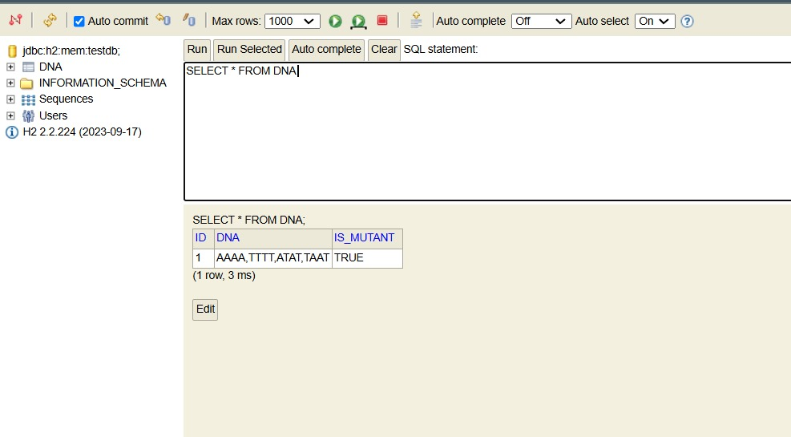
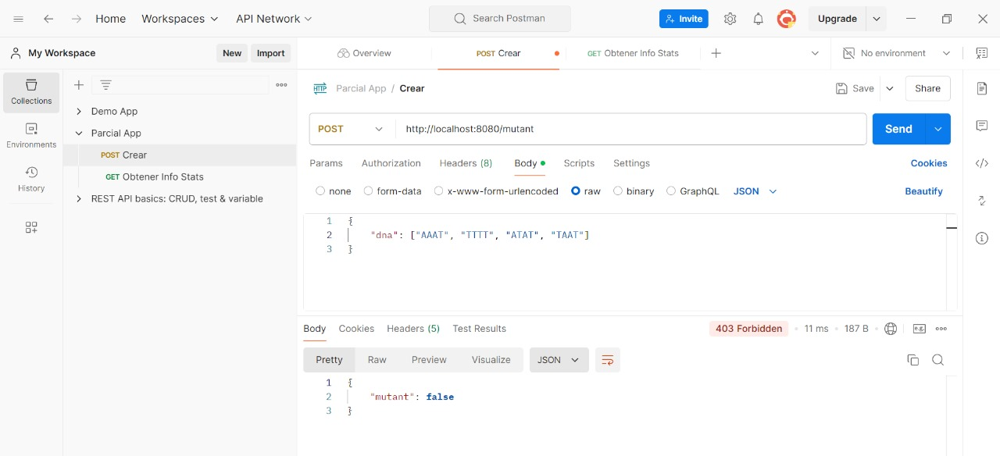
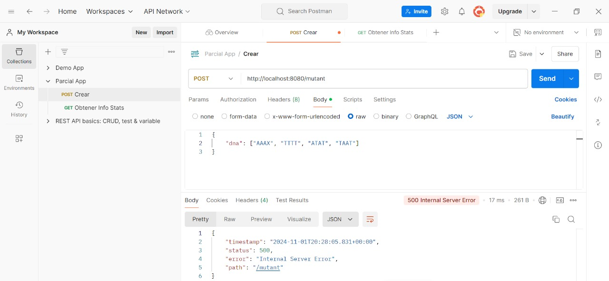
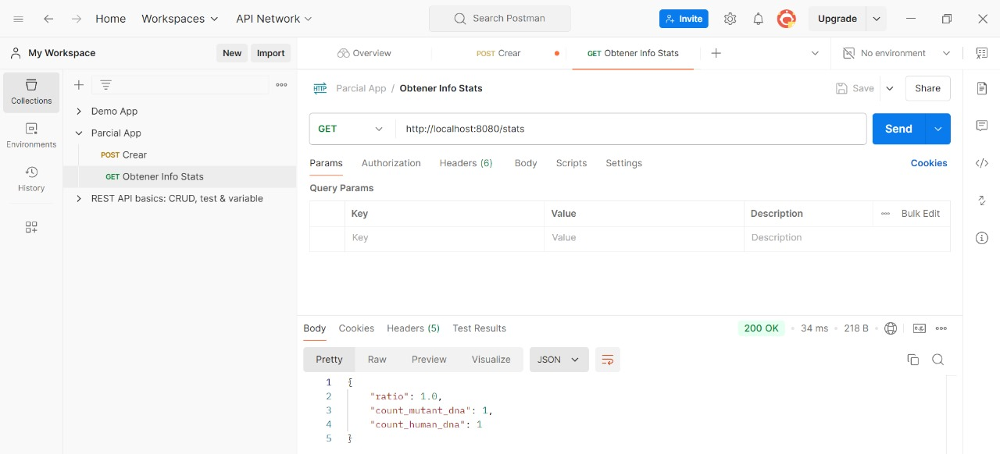

# Primer Parcial Desarrollo de Software - Deteccion de Mutantes
## Autor

**Nombre**: Matias Fernandez

**Legajo**: 49483

**Comisión**: 3K10

---
Este proyecto analiza secuencias de ADN para determinar si son de mutantes o humanos. Utiliza un servicio en Java con Spring Boot que valida la secuencia de ADN, detecta patrones específicos de mutación y guarda los resultados en una base de datos H2.

## Pre-requisitos

- JDK (17)
- IntelliJ IDEA (o cualquier IDE de tu preferencia)
- Gradle (Gestor de Dependencias)
- H2 (Base de Datos)

## Dependencias

### Tecnologías Utilizadas

Este proyecto utiliza las siguientes dependencias y tecnologías:

- Spring Boot Starter Data JPA: Para interactuar con bases de datos usando JPA.
- Spring Boot Starter Web: Para crear APIs RESTful y manejar solicitudes web.
- Lombok: Para reducir código repetitivo como getters, setters y constructores.
- Spring Boot DevTools: Para acelerar el desarrollo habilitando la recarga automática de la aplicación.
- H2 Database: Base de datos en memoria para desarrollo y pruebas.
- JUnit Platform Launcher: Para ejecutar pruebas unitarias con JUnit.
- Spring Boot Starter Test: Herramientas y librerías necesarias para realizar pruebas unitarias en el proyecto.

## Pasos de Ejecucion 

1. Descargar el proyecto
2. Descargar las dependencias necesarias
3. Ejecutar el proyecto
4. Levantar la base de datos H2, navegando a: http://localhost:8080/h2-console/
5. Se puede probar la API localmente o usando render: 
    *   Localmente, con la URL: http://localhost:8080/swagger-ui/index.html
    *   En render, con la URL:
7. Probá la API con Postman o cualquier otro software de tu preferencia
    *   POST (guardar persona local) http://localhost:8080/persona/mutant
    *   POST (guardar persona render)
    *   GET (recuperar estadisticas) http://localhost:8080/persona/stats
    *
## Explicación del algoritmo implementado

### Clase `DnaService`
La clase `DnaService` es el núcleo de la lógica de negocio. Proporciona métodos para analizar secuencias de ADN y determinar si una persona es mutante o humana.

#### Validación del ADN
Antes de procesar el ADN, el método `isMutant` llama a `DnaValidator` para asegurar que:
- La secuencia contiene solo caracteres válidos (`A`, `T`, `C`, y `G`).
- La estructura de la secuencia es una matriz cuadrada (todas las filas tienen la misma longitud).

Si el ADN no cumple con estos requisitos, se lanza una excepción, garantizando así que el análisis se realice únicamente sobre secuencias válidas.

#### Constantes Definidas
- `SEQUENCE_LENGTH`: Longitud mínima de una secuencia de caracteres iguales consecutivos que se necesita para detectar un patrón mutante (en este caso, 4).
- `MIN_MUTANT_SEQUENCE_COUNT`: Número mínimo de secuencias de 4 caracteres iguales (en este caso, 2) para que el ADN se considere mutante.

#### Direcciones de Búsqueda
Para optimizar la detección de mutaciones, se define el arreglo `directions`, que contiene cuatro posibles direcciones de búsqueda:
- `(0, 1)` → Horizontal
- `(1, 0)` → Vertical
- `(1, 1)` → Diagonal hacia la derecha
- `(1, -1)` → Diagonal hacia la izquierda

Cada dirección se aplica desde cada posición inicial `(x, y)` en la matriz de ADN.

#### Búsqueda de Secuencias Mutantes
Dentro de `isMutant`, se exploran todas las filas y columnas en cada una de las cuatro direcciones mediante el método auxiliar `checkAndStoreSequence`. Este método:
1. Verifica si existe una secuencia de 4 caracteres consecutivos en la dirección dada desde la posición `(x, y)`.
2. Si encuentra una secuencia válida, la almacena en `foundSequences`.
3. Si se han encontrado al menos dos secuencias mutantes, retorna `true` indicando que el ADN es mutante.

#### Condiciones de Fin Anticipado
Para optimizar el rendimiento, el método termina el análisis en cuanto detecta dos secuencias mutantes, evitando procesar secuencias adicionales innecesariamente.

#### Método `analyzeDna`
El método `analyzeDna` realiza los siguientes pasos:
1. Comprueba si la secuencia de ADN ya fue analizada en el pasado mediante una consulta al repositorio.
2. Si la secuencia es nueva, la analiza con `isMutant`, guarda el resultado en la base de datos, y retorna si es mutante o no.

## Ventajas del Algoritmo

#### Eficiencia en la Búsqueda
La búsqueda se realiza en cuatro direcciones desde cada posición `(x, y)`, evitando elementos innecesarios. La terminación anticipada optimiza el proceso, ya que se detiene una vez detectadas suficientes secuencias mutantes.

#### Uso de `Set` para Secuencias Únicas
El uso de `Set<String>` asegura que solo se almacenen secuencias únicas, simplificando la gestión de secuencias mutantes distintas.

#### Validación Reutilizable
`DnaValidator` centraliza las validaciones (matriz cuadrada y caracteres válidos), manteniendo el código modular y mejorando la legibilidad y mantenibilidad del método `isMutant`.

#### Persistencia y Consulta Rápida
El almacenamiento en base de datos permite evitar análisis redundantes al verificar primero si el ADN ya ha sido procesado, lo cual mejora la eficiencia cuando se recibe una secuencia repetida.

---

# Pruebas con JMeter
#### 100 Peticiones

#### 1000 Peticiones

---
# Diagramas de Secuencia
### POST /mutant

### GET /stats

---
# Diagrama de Arquitectura

---

## Capturas de Pantalla

#### Post Mutant

#### Base de Datos H2

#### Post Human

#### Ingreso caracter inválido

#### Ingreso matriz no cuadrada

#### Obtener Estadisticas

